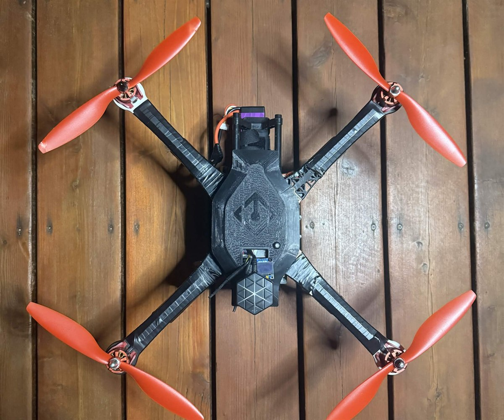
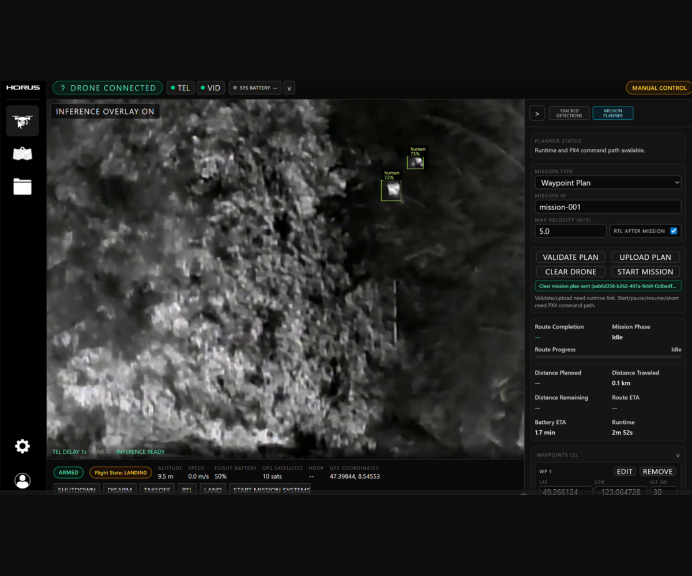

# Quinn Phillips

  <strong>CS @ UBC</strong>
  &middot;
  <strong>SWE Intern @ Microsoft</strong>
  &middot;
  Building autonomous drone systems

  <a href="https://quinntphillips.github.io/">Portfolio</a>
  &middot;
  <a href="https://quinntphillips.github.io/anchor/">Anchor Technical Writeup</a>
  &middot;
  <a href="https://linkedin.com/in/quinntphillips/">LinkedIn</a>

<table>
  <tr>
    <td width="50%" align="center">
      
    </td>
    <td width="50%" align="center">
      
    </td>
  </tr>
</table>
 
I work with C++, Python, TypeScript, robotics, edge ML, developer infrastructure, and systems that connect software to real-world hardware.

## Featured Engineering Work

### Anchor Dynamics - Autonomous Drone Runtime

Offline-first autonomous drone platform for search and rescue, built with Nvidia Jetson Orin Nano, MAVSDK, FastAPI, WebSockets, YOLO, ONNX/TensorRT, React, and Tauri.
Backed by Simon Fraser University's Charles Chang Institute for Entrepreneurship.

<strong>Built:</strong> onboard runtime, autonomy logic, telemetry streaming, mission commands, thermal detection alerts, operator workflow and ML inference pipeline.

<a href="https://quinntphillips.github.io/anchor/">Technical Writeup -&gt;</a>

### Microsoft - Cross-Platform Game Infrastructure

C++ infrastructure for Unreal Engine game systems across Xbox, PlayStation, Windows, and Steam with millions of players.

## Technical Skills

- **Languages:** C++, Python, TypeScript, JavaScript, Java, C, SQL, Rust 
- **Robotics / Edge ML:** Embedded Linux, NVIDIA Jetson, MAVSDK, PX4, OpenCV, YOLO, PyTorch, ONNX, TensorRT 
- **Frontend / Desktop:** React, Tauri
- **Backend / Infrastructure:** Django, FastAPI, Express, PostgreSQL, Redis, WebSockets, REST APIs 
- **Cloud / AI:** Azure, Azure Functions, Azure AI Search, Supabase, RAG, vector indexing

## Links

- **Portfolio:** https://quinntphillips.github.io/
- **Anchor Technical Writeup:** https://quinntphillips.github.io/anchor/
- **LinkedIn:** https://linkedin.com/in/quinntphillips/
